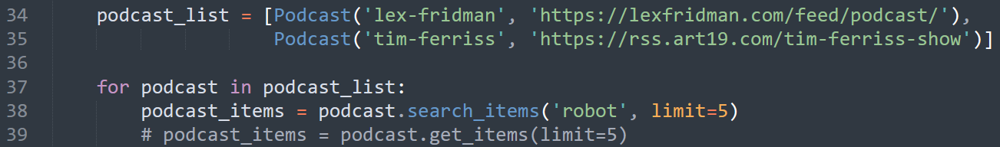

# Programmatic Podcast Downloader & Transcriber
Ever feel like you spend as much time searching for podcasts as you do listening to them? Well put that in the past because this repo allows you to programmatically search through & download podcast episodes you'll find interesting with the simple click of button.


## Setup

To access all of the files I recommend you fork this repo and then clone it locally. 

You will also need to make sure that you have all of the required Python libraries. You can do that by running a 
```pip install -r path/to/requirements.txt```

Now that you have the files & libraries locally, you will want to specify which Podcasts to run. Go into the [download_podcasts.py](https://github.com/blessdog/Podcast-Curator/blob/main/podcast.py) & [transcriptions.py](https://github.com/blessdog/Podcast-Curator/blob/main/transcriptions.py)) and edit the ```podcast_list``` located at the bottom of each file. 


Next you should set how many podcast episodes you want to download from each podcast by modifying the ```limit``` variable. You can also modify the search term to filter which types of episodes you download. In this example it is 'robot'. If you don't want a search term, uncomment the line that says get_items and comment the line that says search_items. See the image below for reference


After you are done with these components, you can run the bash script ```run_all.sh``` to download & transcribe your podcasts. Have fun!
